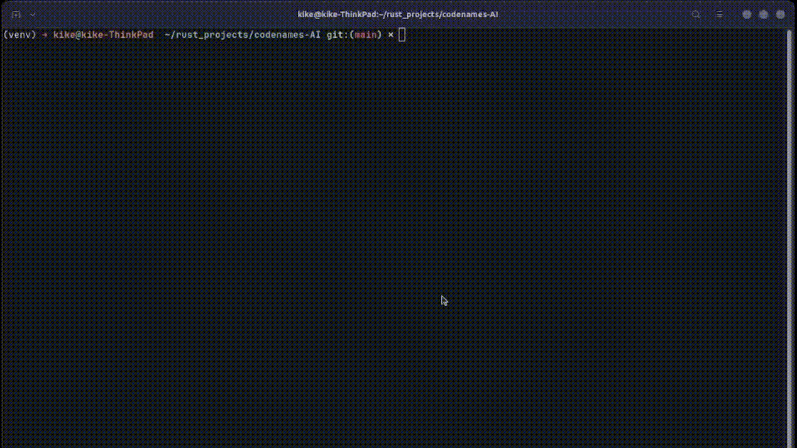

# CODENAMES-AI

Play Codenames alone! 



Codenames is a popular board game designed by Vlaada Chvátil which usually requires teammates to play. In this project, 
a simple transformer-based language model is used so you can play alone.

The user can play as both Spymaster (give clues, AI guesses), or as Agent (AI gives clues, user guesses).

The game mechanica are written in Rust, with the language model being handled by HuggingFace models
in Python. Rust calls the Python interpreter during runtime using `PyO3`.

# How to run

### Docker

The easiest way to run Codenames-AI is through Docker:
```bash
docker build -t codenames docker
docker run -it codenames
```

### Linux / Mac

To run in Linux or Mac, you must have Python 3 and Rust+Cargo installed on your computer.

It is highly recommended to create a virtual environment first to install your Python libraries:
```python
python3 -m venv venv
source venv/bin/activate
```

Finally, install Codenames-AI:
```bash
pip install .

cargo run
```